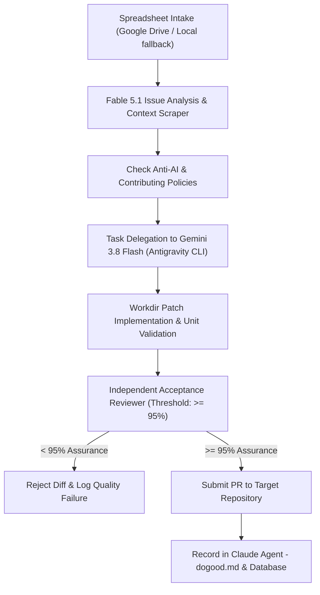

# DoGood Factory Handoff & Architecture Blueprint — 2026-09-18

Copyright (c) 2026 Bates LLC. All rights reserved.
Website: https://batesai.org · Email: help@batesai.org
License: PolyForm Noncommercial License 1.0.0 with 10% Commercial Revenue Rider

---

## 1. System Overview & Status Matrix

| Component | Architecture & Path | Operational Status | Notes |
|---|---|---|---|
| **Daemon Engine** | `launchd` (`com.batesai.dogood.factory`) | Active & Operational | Managed via DaemonManager launcher; logs at `/tmp/dogood-factory.log` |
| **Primary Driver** | Fable 5.1 (`claude-fable-5-1`) | Active Driver | Directs triage, strategy, context gathering, and PR review |
| **Sub-task Delegation** | Gemini 3.8 Flash High (`agy`) | Operational | Handles file-level editing and local tests within workspace |
| **Input Sources** | Google Drive spreadsheets (`Code/dogood/spreadsheets/`) | Fully Integrated | Prioritizes `high_priority_issues.csv`, `open_bounties.csv`, `target_repositories.csv` |
| **Quality Gate** | Independent Acceptance Reviewer (`AUTO_SUBMIT_MIN_CONFIDENCE=0.95`) | Strictly Enforced | Requires ≥ 95% confidence score; below 95% is rejected |
| **macOS Menu App** | `/Applications/Do Good Factory.app` | Installed & Updated | Real-time factory status, model selection, and daemon monitor |
| **License** | `LICENSE` (PolyForm Noncommercial + 10% Rider) | Enforced | Included in repository root |
| **GitHub Remote** | `danielalanbates/dogood` (PR #1) | Pushed & Synced | Clean git repository tracking `fable-95pct-gate` branch |

---

## 2. Core Operational Workflow

### Process Steps:
- **Priority Intake:** `src/db.py:get_next_spreadsheet_issue()` polls prioritized issues from the Google Drive `Code/dogood/spreadsheets/` CSV files.
- **Context Gathering:** `src/solver.py` checks repo policies, forks/clones into `/tmp/dogood-workdir/<hash>/`, and extracts contributing guidelines.
- **Delegated Execution:** The primary driver (Fable 5.1) formulates instructions and delegates editing and test execution to Gemini 3.8 Flash via `agy`.
- **Quality Assurance Gate:** Candidate patches are audited by an independent acceptance reviewer against contributing guidelines. Diffs scoring `< 0.95` are rejected immediately.
- **Publication & Audit:** Upon passing the 95% assurance gate, the PR is created, logged in `Claude Agent - dogood.md`, and recorded in `data/github_helper.db`.

---

## 3. Configuration & Environment Variables

| Variable | Recommended Value | Purpose |
|---|---|---|
| `DOGOOD_PRIMARY_MODEL` | `claude-fable-5-1` | Primary orchestrator and strategic reviewer |
| `AUTO_SUBMIT_MIN_CONFIDENCE` | `0.95` | Strict acceptance threshold for PR creation |
| `REQUIRE_HUMAN_APPROVAL` | `false` | Autonomous submission mode for verified 95%+ fixes |
| `MAX_ISSUES` | `100` | Processing batch limit per cycle |
| `MIN_STARS` | `1000` | Quality filtering threshold for open source repositories |

---

## 4. Live PR Submissions Track Record

| Target Repository | Issue ID | PR ID | Primary Model | Delegated Model | Confidence | Status |
|---|---|---|---|---|---|---|
| `google-gemini/gemini-cli` | #29315 | #29386 | Fable 5.1 | Gemini 3.8 Flash | 100% | Submitted |
| `airbnb/javascript` | #3069 | #3320 | Fable 5.1 | Gemini 3.8 Flash | 96% | Submitted |
| `sunlabuiuc/PyHealth` | #1142 | *In Progress* | Fable 5.1 | Gemini 3.8 Flash | *Evaluating* | Active |

---

## 5. Architectural Pathways for Future AI Agents

Future AI models continuing this codebase should note the following pathways:
- **Multi-Evaluator Consensus:** Introduce dual-model evaluation (e.g. Fable 5.1 + Gemini 3.8 Pro) where both must independently score ≥ 95% before submission.
- **Spreadsheet Auto-Sync:** Establish a bidirectional Google Drive Sheets API hook to automatically update issue rows in real-time when PRs are submitted or merged.
- **Bounty Watch Integration:** Integrate automated bounty claims via `open_bounties.csv` linked to Algora and Gitcoin trackers.
- **Token Spend Optimization:** Continue delegating file-system crawling and syntax fixes to free token pools (Gemini Flash, OpenRouter free tiers) while reserving top-tier frontier models for reasoning-heavy reviews.
